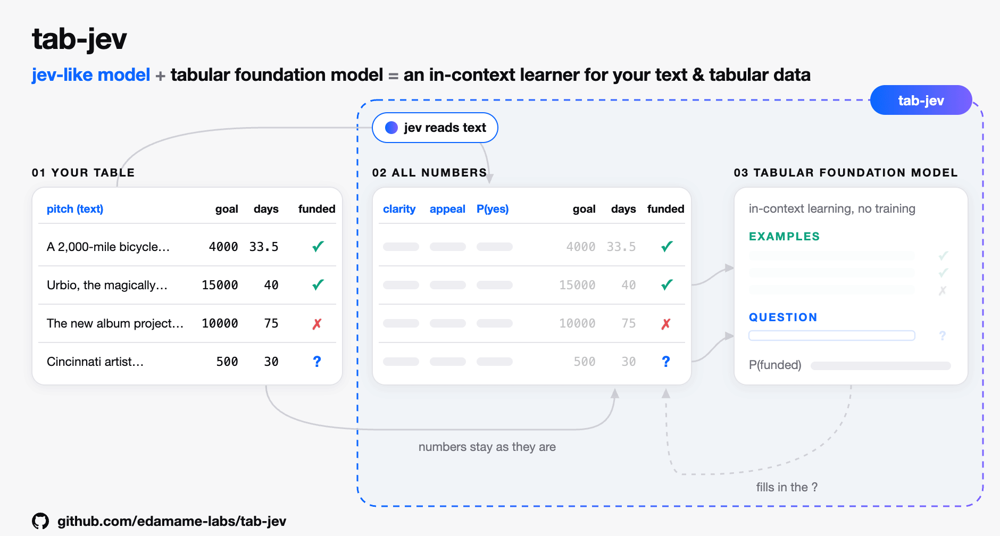

# tab-jev

**A jev-like model + a tabular foundation model = an in-context learner for your text & tabular data.**



Predictions on data that mixes text and tables, with pluggable backends:

- **jev** backends turn text into typed judgments (a chosen option plus probabilities), in the request/response shape of TypeSafe's Jev API.
- **tab** backends are tabular foundation models that predict by in-context learning. Any scikit-learn style classifier works, such as `TabPFNClassifier`.

Jev answers on day one, with no labels. As labels arrive, tab learns from them, together with jev's reading of the text and your other columns. Bring your own backends: tab-jev hosts no models.

Status: pre-release. The API will change.

## When to use tab-jev

tab-jev fits classification problems where:

- the text and the table each carry part of the signal,
- you have only a few labeled rows (dozens to a few thousand),
- you act on the probability (approve, escalate, block).

Churn, fraud and claims screening, lead scoring and ticket escalation are typical.

| If... | Use instead |
|---|---|
| you have no labels | Jev alone |
| the label is a judgment of the text (sentiment, intent) | Jev + calibration |
| the text adds little | a tabular model alone |
| you have 10k+ labels | a supervised model (TF-IDF, embeddings, fine-tuning) |

## Example: will a Kickstarter project get funded?

Kaggle's [Funding Successful Projects on Kickstarter](https://www.kaggle.com/datasets/codename007/funding-successful-projects) has a short pitch (text) and campaign facts (table) for each project, and whether it reached its goal. A few rows:

| name | desc | goal | campaign_days | prep_days | launch_year | country | funded |
|---|---|---:|---:|---:|---:|---|---|
| Rust Belt Ride: a pedal-powered art project | A two-thousand-mile bicycle-powered painting documentary of America's industrial leftovers, the Rust Belt. | 4,000 | 33.5 | 0.9 | 2010 | US | yes |
| Urbio Vertical Garden | Urbio, the magically magnetic urban vertical garden. | 15,000 | 40.0 | 7.0 | 2011 | US | yes |
| The LOVE Project (A working Title) (Canceled) | The new album project from Brett & Emily Mills with all new songs inspired by the Jesus Said Love Movement. | 10,000 | 75.0 | 2.0 | 2011 | US | no |
| 365 Days of Quickies | Cincinnati artist attempts 365 paintings in 365 days. | 500 | 30.0 | 10.3 | 2010 | US | ? |

The last row has no label yet: that is a row to predict.

```python
import pandas as pd
from tabpfn_client import TabPFNClassifier  # or any scikit-learn style classifier
from tab_jev import JevHTTP, Question, jev_then_tab

df = pd.read_csv("train.csv")
X = pd.DataFrame({
    "name": df["name"].fillna(""),
    "desc": df["desc"].fillna(""),
    "goal": df["goal"],
    "campaign_days": (df["deadline"] - df["launched_at"]) / 86400,
    "prep_days": (df["launched_at"] - df["created_at"]) / 86400,
    "launch_year": pd.to_datetime(df["launched_at"], unit="s").dt.year,
    "country": pd.Categorical(df["country"]).codes,  # tab reads numbers
})
y = df["final_status"]  # 1 = funded; leave a row empty (NaN) if you don't know yet

# What we want to predict, as a Jev question.
target = Question("noul", "Will this Kickstarter project reach its funding goal?")

# Extra questions jev answers about the text. Each answer becomes new numeric columns for tab.
rubrics = {
    "desc": {
        "clarity": Question("score", "How clear and concrete is the project pitch?",
                            ["vague", "somewhat clear", "clear", "very clear and concrete"]),
        "appeal": Question("score", "How appealing is the project to potential backers?",
                           ["unappealing", "modest", "appealing", "very appealing"]),
    }
}

model = jev_then_tab(target, JevHTTP(), TabPFNClassifier(), rubrics=rubrics, jev_columns=["name", "desc"])
model.fit(X[:1024], y[:1024])         # rows without a label are ignored; fit() with no data is zero-shot
answers = model.predict(X[1024:2048])  # one Jev-format answer per row: {"type": "noul", "noul": <P(funded)>}
```

`JevHTTP` reads `TYPESAFE_API_KEY` and `TabPFNClassifier` reads `TABPFN_TOKEN`. Both send your rows to their services.

### The same thing, fully local

The Jev API and TabPFN give the best results. If the data can't leave your machine, the package also comes with small open models: [Kev](https://github.com/jaredpalmer/kev) 0.8B, an open Jev reproduction (Apache-2.0), reads the text, and [TabICL](https://github.com/soda-inria/tabicl) (BSD-3) learns from the labels. Nothing leaves the machine and both licenses allow commercial use.

Start Kev (it speaks Jev's `/v1/systemone` format; runs on Apple Silicon with MLX):

```bash
git clone https://github.com/jaredpalmer/kev.git && cd kev && uv sync --extra serve
```

```bash
uv run --extra serve python -m kev.serve --run jaredpalmer/kev-0.8b --port 8009
```

Then use the ready-made local model, with the same target, rubrics and data as above:

```python
from tab_jev import kev_to_tabicl  # pip install "tab-jev[local]"

model = kev_to_tabicl(target, rubrics, url="http://127.0.0.1:8009", jev_columns=["name", "desc"])
model.fit(X[:1024], y[:1024])
answers = model.predict(X[1024:2048])
```

It is the same pipeline with other backends: `jev_then_tab(target, JevHTTP(api_key="local", model="kev-latest", base_url="http://127.0.0.1:8009"), TabICLClassifier(), rubrics=rubrics, jev_columns=["name", "desc"])`. Small models are weaker readers than the Jev API, so expect lower scores; tab still learns how much to trust them from your labels.

### What happens inside

1. **jev reads the text.** For each row, jev answers the rubric questions about `desc`, and the target question itself about `name` and `desc` (`jev_columns`), without labels. For the rows above, the real Jev API answered:

   | project | clarity (0–3) | appeal (0–3) | jev: P(funded) |
   |---|---:|---:|---:|
   | Rust Belt Ride | 2.11 | 2.24 | 0.36 |
   | Urbio Vertical Garden | 0.29 | 1.49 | 0.39 |
   | The LOVE Project (Canceled) | 1.00 | 0.27 | 0.13 |
   | 365 Days of Quickies | 2.29 | 1.42 | 0.41 |

   (These rubric answers are about the name and description together; `demo/eval_benchmark.py` also asks how ambitious the project is.)

2. **The answers become columns.** Every option's probability is a new column, next to `goal`, `campaign_days` and the rest. The text columns are gone: this all-numeric table is what tab sees (shown sideways, one project per column):

   | column | Rust Belt Ride | Urbio Vertical Garden | The LOVE Project | 365 Days of Quickies |
   |---|---:|---:|---:|---:|
   | `goal` | 4000 | 15000 | 10000 | 500 |
   | `campaign_days` | 33.5 | 40.0 | 75.0 | 30.0 |
   | `prep_days` | 0.9 | 7.0 | 2.0 | 10.3 |
   | `launch_year` | 2010 | 2011 | 2011 | 2010 |
   | `country` | 10 | 10 | 10 | 10 |
   | `features:desc.clarity=0` | 0.00 | 0.72 | 0.14 | 0.00 |
   | `features:desc.clarity=1` | 0.14 | 0.27 | 0.73 | 0.11 |
   | `features:desc.clarity=2` | 0.61 | 0.01 | 0.13 | 0.49 |
   | `features:desc.clarity=3` | 0.25 | 0.00 | 0.00 | 0.40 |
   | `features:desc.appeal=0` | 0.00 | 0.05 | 0.75 | 0.01 |
   | `features:desc.appeal=1` | 0.07 | 0.45 | 0.23 | 0.57 |
   | `features:desc.appeal=2` | 0.62 | 0.46 | 0.02 | 0.40 |
   | `features:desc.appeal=3` | 0.31 | 0.04 | 0.00 | 0.02 |
   | `jev:false` | 0.64 | 0.61 | 0.87 | 0.59 |
   | `jev:true` | 0.36 | 0.39 | 0.13 | 0.41 |
   | label (`funded`) | 1 | 1 | 0 | ? |

   `country` is a category code (10 = US). The `features:` columns come from the rubric questions, one per level; the `jev:` columns are jev's own answer to the target question.

3. **tab learns from the labeled rows.** The TFM gets the labeled rows as context (in-context learning, no training) and predicts the unlabeled ones. With no labels, or fewer than 10, tab is skipped and jev's own answer is the prediction.

4. **The prediction comes back in Jev's format**, so code written against the Jev API can read it unchanged.

### What rubrics are

A rubric is a set of extra questions you ask jev about a text column, beyond the question you want answered. They turn free text into numbers tab can use: "how clear is the pitch?" and "how appealing is it?" are signals a table model can't get from raw text. Rubrics are optional; with none, jev only answers the target question.

Write them as narrow, literal questions whose answer you can see in the text. A rubric maps a text column to named questions of the same three types as targets:

```python
rubrics = {"desc": {"appeal": Question("score", "How appealing is the project?", ["unappealing", "modest", "appealing"])}}
```

## Ready-made models

Both wire jev → tab. **For the best predictions, use `jev_to_tabpfn`.** The local models come with the package for when data can't leave your machine, or you want to try tab-jev without API keys.

| Model | jev | tab | Install | Use it for |
|---|---|---|---|---|
| `jev_to_tabpfn(target, rubrics)` | TypeSafe's Jev API (`TYPESAFE_API_KEY`) | TabPFN 3.5 API (`TABPFN_TOKEN`) | `pip install "tab-jev[tabpfn]"` | **Recommended.** The strongest reader and the strongest tabular model |
| `kev_to_tabicl(target, rubrics)` | [Kev](https://github.com/jaredpalmer/kev) 0.8B, an open Jev reproduction you serve yourself | TabICL, on your machine | `pip install "tab-jev[local]"` | Data that must stay local, offline use, trying it out. Weaker, free, commercial use allowed |

```python
from tab_jev import jev_to_tabpfn

model = jev_to_tabpfn(target, rubrics, jev_columns=["name", "desc"]).fit(X, y)
answers = model.predict(X_new)
```

Each part can be swapped on its own: any server that speaks Jev's `/v1/systemone` format works as jev (`JevHTTP(base_url=...)`), and any scikit-learn style classifier works as tab.

## Ways to combine jev and tab

| Preset | Flow |
|---|---|
| `jev_then_tab` | jev turns text columns into features and answers the target; tab predicts from all of it |
| `tab_then_jev` | tab predicts first; jev makes the final call with tab's probabilities and labeled examples in the state |
| `parallel_blend` | jev and tab predict separately; a cross-validated weighted average combines them |

On Kickstarter, `jev_then_tab` does best and `tab_then_jev` worst. See [demo/](demo/) for the evaluation.

Or compose the steps yourself:

```python
from tab_jev import Blend, JevAnswer, JevFeatures, Pipeline, TabPredict

pipeline = Pipeline(target, [
    JevFeatures(jev, rubrics),
    JevAnswer(jev, target, shots=8),  # few-shot: labeled examples go into the state
    TabPredict(tab),
    Blend(["jev", "tab"]),
])
```

When a step that learns from labels feeds another one, the pipeline gives it out-of-fold outputs, so no step sees a prediction made with a row's own label.

## Targets

Targets use Jev's three question types: `noul` (yes/no), `choice` (one of several options) and `score` (2–10 ordered levels). A `score` answer is the probability-weighted level index, as in Jev. `confidence` is the top class probability.

## Writing a backend

A jev backend has a `probability_source` attribute (`"native"`, `"logprobs"` or `"sampling"`) and a method `judge(state, questions)` that returns `{name: Answer}`. Wrap it in `CachedJev` to avoid paying twice for the same question.

A tab backend has `fit(X, y)`, `predict_proba(X)` and, after fitting, `classes_`. It may declare `limits = TabLimits(...)`, which are checked before it is called.

## License

Apache-2.0
